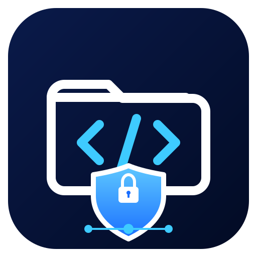
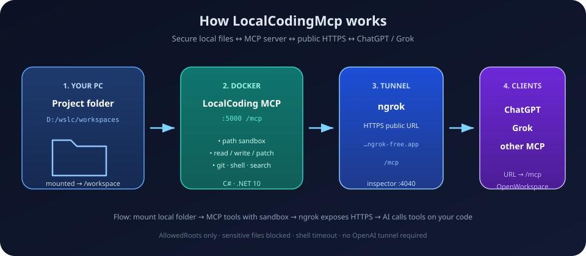

<p align="center">
  
</p>

<p align="center">
  
</p>

# LocalCodingMcp

Secure local coding **MCP server** (C# / .NET 10) for **ChatGPT**, **Grok**, and other MCP clients.

Open a project folder (under approved roots only), list/read/write/patch files (including binary via base64), search code, run shell commands, and inspect git — all path-sandboxed.

### How it works (short)

1. **Your PC** — mount a folder (e.g. `D:/wslc/workspaces`) into the container as `/workspace`
2. **Docker** — LocalCoding MCP listens on `:5000/mcp` with path sandbox + tools
3. **ngrok** — public HTTPS URL so remote clients can reach you
4. **ChatGPT / Grok** — connect with **URL** → `https://…/mcp`, then `OpenWorkspace`

| | |
|---|---|
| **Setup (ngrok / Windows / WSL)** | **[SETUP.md](SETUP.md)** |
| **TermuxHost / Android ZIP** | **[TERMUXHOST.md](TERMUXHOST.md)** |
| **Tool reference** | [LocalCodingMcp/README.md](LocalCodingMcp/README.md) |
| **CI** | [](https://github.com/dhhieu113pro/local-coding-mcp/actions/workflows/ci.yml) |
| **Docker image** | `ghcr.io/dhhieu113pro/local-coding-mcp:latest` |
| **License** | [MIT](LICENSE) |

---

## Quick start

Full guide: **[SETUP.md](SETUP.md)**

```powershell
git clone https://github.com/dhhieu113pro/local-coding-mcp.git
cd local-coding-mcp
copy .env.example .env
# edit .env → NGROK_AUTHTOKEN, MCP_WORKSPACE=D:/wslc/workspaces

docker compose up -d
docker compose --profile ngrok up -d

curl http://127.0.0.1:5000/health
docker compose logs ngrok
# copy https://xxxx.ngrok-free.app
```

ChatGPT / Grok → **Connection → URL** → `https://xxxx.ngrok-free.app/mcp` → new chat → `OpenWorkspace` with `/workspace/...`.

### TermuxHost release ZIP

For native Android/Termux hosting, push a `v*` tag. GitHub Actions publishes and smoke-tests:

```text
local-coding-mcp-termux-aarch64.zip
local-coding-mcp-termux-aarch64.zip.sha256
```

The ZIP is framework-dependent and uses the .NET 10 runtime installed by TermuxHost. See **[TERMUXHOST.md](TERMUXHOST.md)** for deployment settings.

---

## Compose stack

| Service | Profile | Port | Role |
|---------|---------|------|------|
| `local-coding-mcp` | (default) | **5000** | MCP `/mcp` |
| `ngrok` | **`ngrok`** | **4040** inspector | Public HTTPS to MCP |
| `code-server` | **`ide`** | **8443** | Browser VS Code |
| `termux` | **`termux`** | — | Termux-like test shell |

Network: **`mcp-net`**. Secrets: **`.env`** (see `.env.example`).

---

## Typical tool flow

```text
OpenWorkspace(path)  →  workspace_id
ListDirectory / ReadFile / SearchFiles
WriteFile / WriteBinaryFile / ApplyPatch
RunCommand
GitStatus / GitDiff / GitLog
```

---

## Tool list (summary)

| Tool | What it does |
|------|----------------|
| **OpenWorkspace** | Open folder under allowed roots → `workspace_id` |
| **ListWorkspaces** | List open workspaces |
| **GetAllowedRoots** | Show allowed roots |
| **ListDirectory** | List files/dirs |
| **ReadFile** | Read text file |
| **WriteFile** | Create/overwrite text file |
| **WriteBinaryFile** | Write binary (PNG/JPG/…) from base64 |
| **ReadBinaryFile** | Read binary as base64 |
| **ApplyPatch** | Unified diff |
| **SearchFiles** | Regex/text search |
| **CreateDirectory** | Create directory |
| **MoveFile** | Move/rename |
| **DeleteFile** | Delete file/empty dir |
| **GitStatus** / **GitDiff** / **GitLog** | Git inspect |
| **RunCommand** | Shell in workspace |
| **GetExecutionHistory** | Recent persisted tool calls, status, and duration |

Details: **[LocalCodingMcp/README.md](LocalCodingMcp/README.md)**

Every MCP tool call is appended to `LocalCodingMcp/data/execution-history.jsonl`. Sensitive
arguments such as file content, base64 data, tokens, passwords, and secrets are redacted.
The log rotates at 10 MiB by default so repeated LLM calls do not grow storage without limit.
Docker Compose persists it on the host in `./history` (override with `MCP_HISTORY`).

---

## Branding

- Logo: [docs/logo.svg](docs/logo.svg)
- How it works diagram: [docs/how-it-works.svg](docs/how-it-works.svg)
- ChatGPT connector icon: square **512×512 PNG** export of the logo

---

## Safety

- Paths only under **AllowedRoots** (`/workspace` in Docker)
- Blocks path traversal, symlink escape, sensitive names
- Do not expose 5000 / 8443 / ngrok URL without care

---

## Dev (dotnet)

```bash
dotnet test LocalCodingMcp.sln -c Release
dotnet run --project LocalCodingMcp
```

---

## Build image locally

```bash
docker build -t local-coding-mcp .
docker run --rm -p 5000:5000 \
  -e AllowedRoots__0=/workspace \
  -v "D:/wslc/workspaces:/workspace" \
  local-coding-mcp
```
